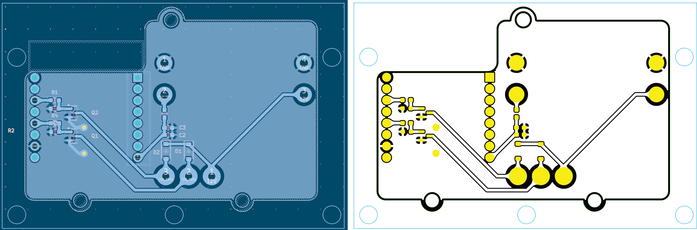
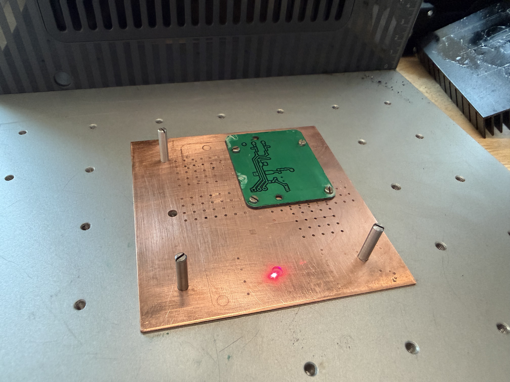

# KiCad Laser Tracer

Generate SVGs from KiCad PCB files for laser cutting. A streamlined
workflow for producing two-sided boards accurately and repeatedly.



## Features

- Generates isolation paths (areas where copper needs to be removed)
  as filled SVG regions
- Uses KiCad's native boolean operations for accurate geometry
- Outputs separate SVG files for each copper layer plus edge cuts and
  drill points
- Targets xTool Studio but should be useful for Lightburn or other
  software

## Process Overview

This project was born from my desire to make my own FR4 PCBs at home
using the xTool F2 Ultra. Stephen Hawes did [a lot of
work](https://github.com/sphawes/fiber-laser-pcb-fab) that inspired
this project.

My goal was to do *everything* with the laser, including contours,
drilling, traces, and mask removal. It had to be a repeatable process
with high reliability, otherwise one may as well order from PCBway or
whatever.


`kicad-laser-tracer` produces SVGs that enable this entire process;
it's not just about generating paths for engraving isolation traces,
but making sure you can position the board accurately, flip for the
second side, and return the board to the right place for mask removal!

The complete process looks like this:

- *Fixturing*: mostly one-time setup so that you have a spoilboard
  to protect the base plate of the laser, and known good coordinates
  for positioning your SVGs. We cut a template based on known
  fiducials, inside of which is our PCB held to the template with
  tabs. The template can be flipped, and the PCB can be re-inserted in
  the template if required later.
- *Cutting and Engraving*: we can now cut the board profile, drill
  holes, and remove copper to isolate the PCB traces. The template is
  flipped and the process repeated for the back side if applicable.
- *Tin-plating*: we clean the assembly with IPA to remove laser schmoo
  and prepare the copper, then dunk in liquid tin to protect it.
- *Solder mask*: we use a silkscreen and apply solder mask followed by
  a UV cure for both sides.
- *Mask removal*: we re-install the template and remove solder mask,
  on both sides if applicable.
- *PCB removal*: the PCB can now be broken away from the template, the
  tabs filed, and it's ready for the SMD oven or soldering iron.

## Usage

### Requirements

- KiCad 5.0 - 9.0 installed
- [uv](https://docs.astral.sh/uv/) package manager

The CLI automatically detects your KiCad installation and uses KiCad's bundled Python - no manual configuration needed.

### Running

```
# install
uv tool install git+https://github.com/hagmonk/kicad-laser-tracer

# running against an example
kicad-laser-tracer --multi --all example/example.kicad_pcb
```

This produces SVGs for the front and back. Dragging one of these SVGs
into XCS produces a nice clean result with multiple layers.

XCS groups objects into layers by color, and I have assigned colors to
different KiCad layers for a consistent result. This is the order in
which they appear in XCS, which is *not* the order in which they
should be processed

* *Cyan* - `User.Comments` - I use this layer for the board template
  which captures the fiducials from the laser base plate.
* *Yellow* - `Mask` - curves for mask removal
* *Orange* - `Cu` - curves from the copper layer corresponding to
  through holes to be drilled
* *Black* - `Cu` - curves from the copper layer representing isolation
  traces
* *Green* - `Edge.Cuts` - the board outline itself, used for the final
  cut

Individual SVGs can be generated for different layers, although I
stronly encourage keeping all layers together so you're able to align
everything relative to your fiducials.

- `isolation_F_Cu.svg` - Front copper isolation paths
- `isolation_B_Cu.svg` - Back copper isolation paths
- `edge_cuts.svg` - Board outline
- `drill_holes.svg` - Drill hole locations (with `--drill` or `--all`)
- `solder_mask_*.svg` - Solder mask openings (with `--mask` or `--all`)
- `multi_color_pcb.svg` - Combined multi-layer SVG (with `--multi`)

## Laser setup

### Board selection

Stephen dialed in settings for the F1 Ultra, but these don't apply
cleanly to the much more powerful MOPA source in the F2 Ultra.
Additionally he stuck to FR1. My problem with FR1 is that I wanted to
do *everything* with the laser - including cutting and drilling. After
close to a week of trial and error to find settings that cut FR1
cleanly on the F2 Ultra, I gave up and switched to FR4.

The difference was magical. With FR4 I am able to get relatively clean
contours and drilled holes, with FR1 there is no way to cut or drill
using a laser that doesn't turn the inside of the board into a
carbonized mess. Delamination of traces has also disappeared as an
issue.

Good ventillation is a must for working with FR4, but you should have
excellent ventillation for laser cutting and engraving regardless. I
use the xTool AP2 vented through a window.

### xTool F2 Ultra settings

Disclaimer! Some of these settings are a bit hit & miss, and since I
last made a PCB, xTool Studio has been updated to include a much more
functional way of stepping the laser focus down per each pass.
Previously it was very broken. So I expect in the near future to
revise these for even cleaner results!

| Setting | Holes          | Isolation traces | Contour  | Mask            |
|---------|----------------|------------------|----------|-----------------|
| Op      | Engrave        | Engrave          | Cut      | Engrave         |
| Laser   | MOPA IR        | MOPA IR          | MOPA IR  | MOPA IR         |
| Power   | 60%            | 78%              | 80%      | 20%             |
| Speed   | 5000 mm/s      | 5000 mm/s        | 200 mm/s | 2000 mm/s       |
| Pass    | 10             | 7                | 15       | 20              |
| Lines   | 300            | 300              | -        | 300             |
| Mode    | Bi-directional | Uni-directional  | -        | Uni-directional |
| Pulse   | 500 ns         | 500 ns           | 500 ns   | 60 ns           |
| Freq    | 30 kHz         | 30 kHz           | 30 kHz   | 115 kHz         |
| Tabs    | -              | -                | 6 x 1 mm |                 |

### Spoilboard and fiducials



Producing a spoilboard is left as an exercise for the reader. I cut
some brass plate on the Carvera CNC with appropriate hole spacing for
the xTool F2 Ultra base plate. The holes are spaced 35mm apart with an
annoying missing hole in the middle. I use M4 studs from McMaster to
position the spoilboard. When the PCB template is cut, you'll remove
these studs and reinstall them through the holes in the template.

## Troubleshooting

### "Could not find KiCad's Python interpreter"

Ensure KiCad is installed in a standard location:
- **macOS**: `/Applications/KiCad/KiCad.app`
- **Linux**: `/usr` or `/usr/local`
- **Windows**: `C:\Program Files\KiCad`

### Debug messages from wxWidgets

The "Debug: Adding duplicate image handler" messages are harmless warnings from KiCad's libraries when running outside the GUI.

## Note on KiCad 10+

The SWIG-based `pcbnew` Python bindings are deprecated as of KiCad 9.0 and will be removed in KiCad 10.0 (February 2026). Future versions may migrate to KiCad's IPC API.
